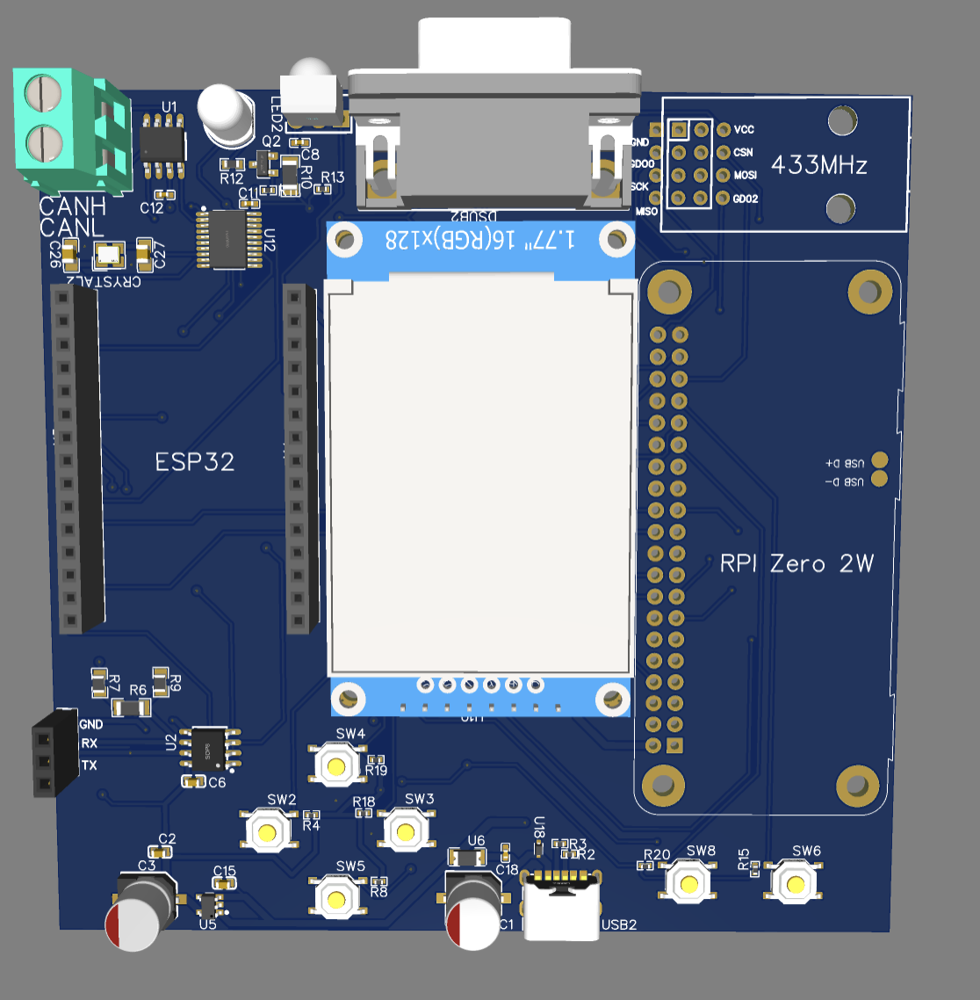

# 🛠️ DevoMultiX – Open-Source Multitool

!!! danger "Still in Development"
    **DevoMultiX is currently in an early development phase!** Features are being added and hardware designs may change.

**DevoMultiX** is a portable multitool for electronics and network analysis, based on a hybrid architecture using an **ESP32** and a **Raspberry Pi Zero 2 W** running **Debian**.

It is aimed at hobbyists, developers, technicians, and makers who want a compact but powerful tool for lab or field use.

---

## 📸 Gallery / Device Preview

<!-- You can add your own images here later (e.g., copy them to the "docs/assets/" folder and adjust the path) -->

  
   
  <em>View of the current DevoMultiX prototype</em>

---

## 🔍 What is DevoMultiX?

A universal diagnostic and analysis device for:

- 🔬 **Reverse Engineering**
- ⚡ **Signal and voltage measurement**
- 🌐 **Network analysis and security tools**

Designed as an all-in-one handheld tool combining microcontroller real-time capabilities with a full Linux system.

---

## 📚 Documentation Overview

-   :material-magnify-scan: **[Reverse Engineering](reverse_engineering.md)**
    ---
    UART, JTAG, SPI, and Firmware analysis.

-   :material-sine-wave: **[Signal Measurement](signal_measurement.md)**
    ---
    Logic analysis, CAN-Bus, RS485, and ADC.

-   :material-network-outline: **[Network Analysis](network_analysis.md)**
    ---
    Wi-Fi scanning, nmap, and IT security tools.

-   :material-memory: **[Hardware](hardware.md)**
    ---
    ESP32, Raspberry Pi Zero architecture.

-   :material-circuit-board: **[Circuits](circuits.md)**
    ---
    Schematics, pinouts, and PCB designs.

-   :material-linux: **[Software](software.md)**
    ---
    Debian environment overview.

-   :material-map-legend: **[Roadmap](roadmap.md)**
    ---
    Current status: ESP32 software development.

-   :material-history: **[Changelog](changelog.md)**
    ---
    Tracking latest project updates.

-   :material-chip: **[ESP32 Firmware](esp32_firmware.md)**
    ---
    Architecture and flashing instructions.

-   :material-rocket-launch: **[Getting Started](installation.md)**
    ---
    Installation, flashing, and hardware setup.

-   :material-script-text-outline: **[Adding Scripts](scripts.md)**
    ---
    How to extend DevoMultiX with Python/Bash.

-   :material-handshake-outline: **[Contributing](contributing.md)**
    ---
    How to contribute and join the project.

---

## ⚡ Currently Implemented Features

- **ESP32 (Real-Time / Hardware Layer)**

    ---

    - **Wi-Fi Scanning**
        - Discover network devices
        - ARP scanning
        - MAC address analysis

    - **RS232 & RS485**
        - MAX3232 (RS232)
        - MAX3485 (RS485)
    - **IR Communication**
        - TSOP4838 receiver
        - IR LED transmitter (e.g. remote control analysis)

-   :material-linux: **Raspberry Pi Zero 2 W (Linux / High-Level Layer)**

    ---

    - **Full Linux environment** (Debian)
    - **1.77" SPI Display (AZDelivery)**
        - Menu-driven interface
        - Controlled via 6 hardware buttons
    - **Execution of advanced tools:**
        - `nmap`, `airodump-ng`, `reaver`, `tcpdump` / Wireshark (remote)
    - **Script execution** from SD card
    - **Data logging & storage** (up to 128 GB SD)
    - **Co-processor control (ESP32)**
        - UART interface (TX/RX connected as shown in schematic)
        - Sending commands to ESP32 to execute real-time hardware tasks

---

## 🛠 Planned Features

### 🧰 Hardware
- 🔋 **Battery with charging management** (stand-alone operation)
- 📡 **Sub-1 GHz RF module** (CC1101 already included for ASK / OOK signals like garage doors, remote switches)
- 🚗 **CAN-Bus interface** (already present in schematic via MCP2515 + SN65HVD230)
- 🛡️ **Improved shielding** and signal integrity for mixed-signal usage

### 💻 Software / Firmware
- **ESP32**
    - Signal measurement & GPIO analysis
    - Real-time hardware control
    - UART bridge listening to Raspberry Pi commands
- **Raspberry Pi Zero 2 W**
    - Advanced menu system (Display GUI)
    - Integration of penetration testing tools
    - USB HID attacks (Rubber Ducky style)
    - Packet sniffing & MITM tools
    - Firmware analysis tools: `binwalk`, `Ghidra`, `radare2`

---

## 🎯 Target Audience

* 🔓 Hardware hackers & reverse engineers
* 💻 Embedded developers
* 🛡️ Network / security technicians
* 🔧 Makers & DIY enthusiasts

---

## 🖥 System Overview

| Component | Description |
|-----------|-------------|
| **Core 1** | ESP32-WROOM-32E (8 MB Flash) |
| **Core 2** | Raspberry Pi Zero 2 W |
| **Display** | 1.77" SPI Display (ST7735) |
| **Interfaces** | RS232 & RS485 (via MAX3232 / MAX3485), CAN Bus (via MCP2515 + SN65HVD230) |
| **Wireless** | CC1101 Sub-GHz RF module, IR Receiver (TSOP4838) + IR LED |
| **Input**| 6 navigation buttons (with pull-ups as in schematic) |
| **Power** | USB-C power + 3.3V regulator (TPA2112K) |
| **Ports** | Measurement & interface ports (UART, IR, CAN, RF) |
